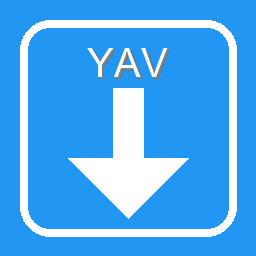

<p align="center">
  
</p>

<h1 align="center">YAVDownloader</h1>
<p align="center">Yet Another Video Downloader — a clean GUI for yt-dlp.</p>

<p align="center">
  
  
  
  
</p>

## ✨ Highlights
- 🎬 Video & audio download with quality selection
- 📂 Playlist selector
- ✂️ Trim and 🔄 remux (FFmpeg)
- 🧩 Templates and 📄 logs

## ✅ Requirements
- Python 3.12+
- `yt-dlp` executable
- `ffmpeg` (for trim/remux/convert)

## 🚀 Run (dev)
```bash
uv run python main.py
```

## 🧰 Build (Windows)
```bash
uv run pyinstaller --clean yt-dlp-gui.spec
```

## ⬇️ Download (Executable)
Get the latest build from the GitHub Releases page:

[Download from GitHub Releases](https://github.com/Uryaaa/yavd/releases)
